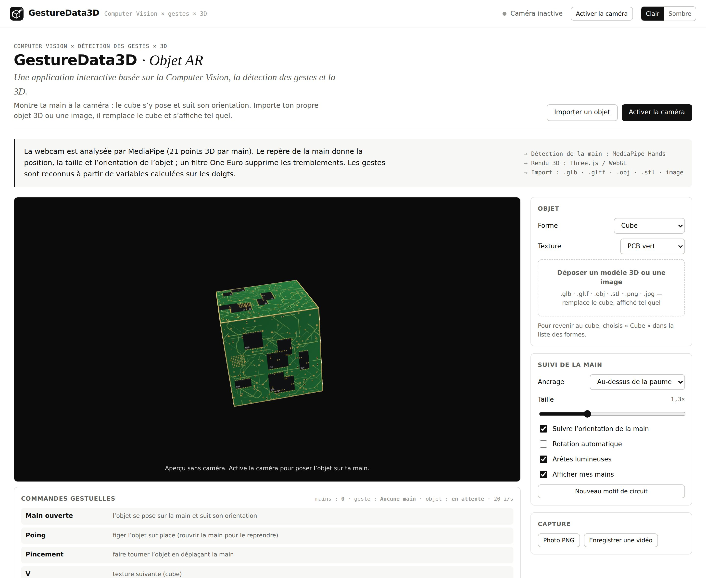
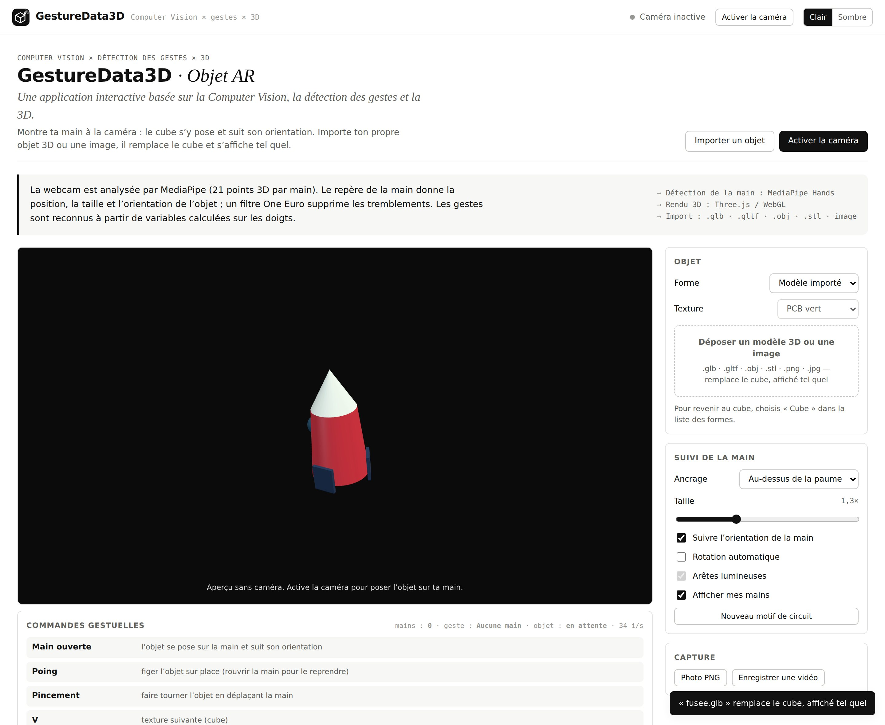
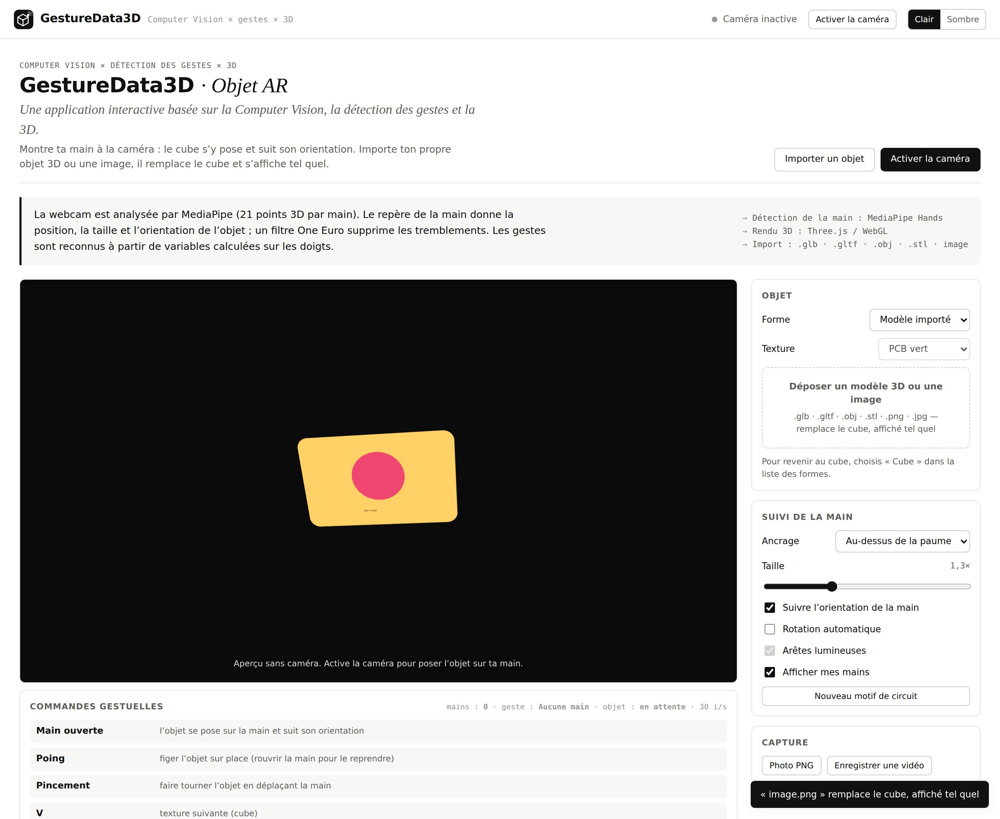
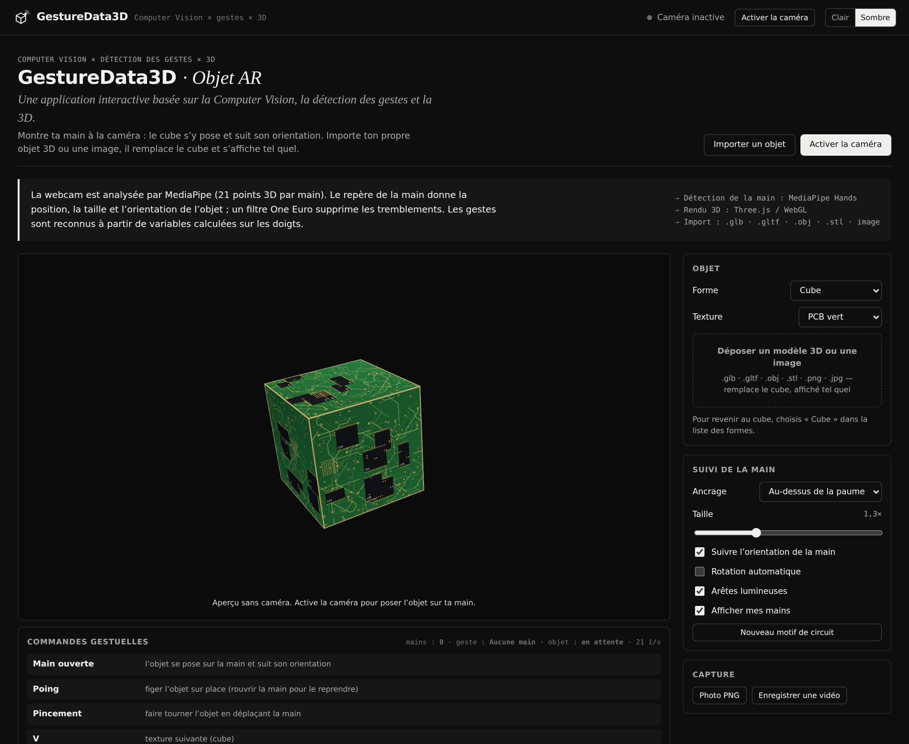

# 🧊 GestureData3D · Objet AR

**GestureData3D est une application interactive basée sur la Computer Vision, la détection des gestes et la 3D.**

Tu montres ta main à la webcam et un cube 3D, texturé comme un circuit imprimé, se pose dessus et suit ses mouvements. Tu peux aussi importer ton propre objet 3D ou une image : il remplace le cube et s’affiche tel quel.

> 🔬 Projet exploratoire : l'objectif est de tester la chaîne complète *caméra → détection de la main → données → objet 3D* directement dans le navigateur.



---

## ✨ Fonctionnalités

- ✋ **Suivi de la main** : 21 points 3D par main, jusqu’à deux mains.
- 🧊 **Objet ancré** : position, taille et orientation calculées à partir de la main, puis lissées par un filtre One Euro.
- 📦 **Import d’objets** : `.glb`, `.gltf`, `.obj`, `.stl` ou une image, affichés tels quels (matériaux et couleurs d’origine).
- 🎨 **Cube circuit imprimé** : textures générées par le code (vert, bleu, noir et or, violet).
- 📸 **Capture** : photo PNG et vidéo de la scène.
- 🌗 **Thème** clair ou sombre.

## 👆 Gestes

| Geste | Action |
|---|---|
| ✋ Main ouverte | l’objet se pose sur la main et suit son orientation |
| ✊ Poing | figer l’objet sur place |
| 🤏 Pincement | faire tourner l’objet |
| ✌️ V | texture suivante (cube) |
| ☝️ Index | forme suivante |
| 👍 Pouce levé | photo |
| 🙌 Deux mains | objet placé entre les mains, l’écart règle la taille |

## 🚀 Lancer

1. Décompresse le dossier.
2. Double-clique sur **`index.html`** (Chrome ou Edge).
3. Clique sur **Activer la caméra**.

💡 Si la caméra est bloquée, lance `start.bat` (Windows) ou `./start.sh` (macOS / Linux) pour ouvrir `http://localhost:8000`.
🌐 La connexion internet est nécessaire au premier lancement pour charger le modèle de détection des mains.

## 🖼️ Captures

| Objet 3D importé | Image importée |
|---|---|
|  |  |



## 🛠️ Technologies

`MediaPipe Hands` · `Three.js / WebGL` · `JavaScript` · `esbuild`

## 📁 Structure

```
index.html            page de l'application
css/style.css         styles (clair / sombre)
js/main.js            démarrage, thème, caméra
js/core/              caméra, modèle des mains, gestes, filtres, texture circuit
js/sections/cube.js   objet AR
dist/app.js           version regroupée chargée par index.html
vendor/               three.js et chargeurs de modèles 3D
docs/                 captures d'écran
```

Après modification de `js/`, régénère `dist/app.js` avec `npm install` puis `npm run build`.

---

👤 **Yahya Tamouch** · INSEA
